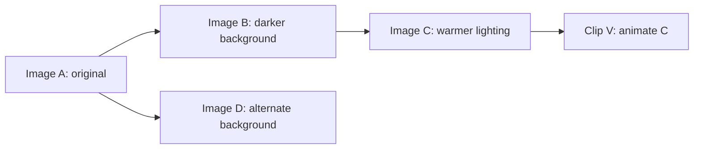

# Vidra workflow, conversation history, and version contract

**Specified:** 2026-10-09, America/Chicago. **Status:** design specification for review and implementation; not a claim about shipped behavior. This is the detailed replacement for the workflow assumptions removed by [ADR-0024](../../adr/0024-creation-has-no-required-order.md). [ADR-0025](../../adr/0025-conversations-requests-and-media-versions-have-separate-history.md) records the history decision. [Current-source evidence](../2026-10-09-history-state-inventory.md) identifies implementation differences.

This document chooses behavior rather than leaving alternatives for implementers. A design review may change the choices explicitly. Until then, an implementation must not invent a different default. The scope is single-owner projects containing image work, video generation, video editing/export, conversations, uploads, Sketch, and public read-only sharing. Multiple conversations and multiple tabs are included. Simultaneous editing by different project members, generative audio, automatic publishing to social networks, and arbitrary background agents are not offered by this version.

The [readable state map](state-map.md) lists every state and transition; its source is [state-model.json](state-model.json). The [acceptance cases](acceptance-cases.md), backed by [acceptance-cases.json](acceptance-cases.json), cover histories and interactions between those states. `python3 docs/design/workflow/validate_contract.py` checks structural completeness and model traces. It does not prove the application implements the contract or that every possible future feature has been anticipated.

The [implementation plan](implementation-plan.md), [per-state implementation coverage](implementation-coverage.md), and [test assignments](implementation-tests.md) turn this behavior into work packages. `python3 docs/design/workflow/validate_implementation_plan.py` checks that no declared state, transition, rejection, case or action adapter is omitted from that plan.

## 1. The six things a creator must be able to distinguish

| Thing                 | Meaning                                                                                                  | Authority                                                                                                      |
| --------------------- | -------------------------------------------------------------------------------------------------------- | -------------------------------------------------------------------------------------------------------------- |
| Project               | Related conversations, source material, media versions, video edits, and exports.                        | Server-owned identity and owner. A new local project gets an idempotent server identity before any generation. |
| Conversation          | An ordered record of requests, questions, answers, and results within a project.                         | Accepted entries have server sequence numbers. Completion time does not reorder requests.                      |
| Draft                 | An unfinished request: action, instructions, explicit inputs, settings, destination, and context.        | A separately saved, revisioned record. It remains editable while other jobs run.                               |
| Request               | The exact submitted work, including inputs, settings, context, output count, and allowed cost.           | Immutable after acceptance. A receipt identifies it even if the response is lost.                              |
| Media version         | A particular image, clip, or imported file, with its actual source versions.                             | Immutable bytes/handles and provenance. New edits produce new versions.                                        |
| Video edit and export | An editable arrangement of specific media versions, and a file rendered from one captured edit revision. | The edit has revisions; every export names exactly one revision.                                               |

“Session” remains a legacy storage name, not another user-facing kind of work. Existing sessions and Studio projects must keep their IDs through an explicit adapter. A migration must never infer that two records are the same project merely because their titles, prompts, or timestamps match.

### Identity rules

- **H01:** Every project, conversation, draft, request, output slot, media version, video edit revision, and export has an immutable ID. Names and timestamps are never identity.
- **H02:** A media item groups versions of the same work. Image edits stay in that item's version history. Animating an image creates a new clip item with the image version recorded as a source. Combining material creates a video edit with its own history.
- **H03:** Each request has an ordered list of output slots fixed at acceptance. Four requested variations have four stable slots. Failures remain in their slots. Results arriving in a different order do not renumber them.
- **H04:** Each generated/edit result records exact source version IDs and roles, producing request ID, slot ID, provider/model actually used, instructions actually sent, settings, and known outcome/cost facts. Unknown upload provenance remains unknown.
- **H05:** Accepted request, edit and export inputs always identify a version. They never mean “whatever is newest now.” A draft input is explicitly either a resolved `versionId` or a pending `(requestId, outputSlotId)` reference. A pending reference is forbidden in an accepted request and must resolve to its own durable version before submission. Preferred-version changes cannot substitute another input.
- **H06:** A media item's preferred version and a version's favorite marker are explicit user choices. Neither means the output passed creative-quality review. Completion alone does not set either.

## 2. Conversation history and media history

The conversation is chronological. Media history can branch. These are two views of the same work, with different purposes; the UI must not pretend that the latest message is the latest version of every asset.

In this example, D is an edit of A, not an edit of C. C remains available. V keeps C as its source even if the creator later prefers D. The conversation displays each submitted request in acceptance order and links each result to its actual parent.

### Exact meaning of history actions

| Action                                      | Request/context behavior                                                                                                                                                                 | Media behavior                                                                               | What happens to existing history                                                                                        |
| ------------------------------------------- | ---------------------------------------------------------------------------------------------------------------------------------------------------------------------------------------- | -------------------------------------------------------------------------------------------- | ----------------------------------------------------------------------------------------------------------------------- |
| View / play / fullscreen                    | Changes only the viewer and playback.                                                                                                                                                    | Reads the selected version.                                                                  | No draft, context, input, preference, or message changes.                                                               |
| Edit this version                           | Parks the current meaningful draft; opens a draft targeting this exact version and its branch context.                                                                                   | A successful run creates a child version.                                                    | Other versions and requests remain.                                                                                     |
| Animate this image                          | Opens a video draft with this version in the starting-image role.                                                                                                                        | Produces a new clip item referencing the image.                                              | The image and its other children remain.                                                                                |
| Make another variation                      | Copies the producing request's inputs/settings/context and instruction to a new editable draft.                                                                                          | On submit, creates alternatives from the same base, not children of the result being viewed. | Original request and all its slots remain.                                                                              |
| Try again after a proven generation failure | Copies only the failed slot(s) selected by the creator into a new draft; shows new cost.                                                                                                 | New request/slot IDs record `retryOf`. Successful original slots are not rerun.              | Original failure evidence remains.                                                                                      |
| Resume / reconnect / check status           | Uses the original request ID/receipt.                                                                                                                                                    | No new generation.                                                                           | Updates observations of the same request.                                                                               |
| Retry saving / repair project link          | Reuses the original stored output and request.                                                                                                                                           | No new version or generation.                                                                | The original output's storage/link state changes.                                                                       |
| Reuse setup                                 | Copies the selected request's exact instruction, inputs, action, settings, and context into a new draft in the current conversation. Current capability/ownership/cost checks run again. | Nothing runs until submit.                                                                   | Provenance records the reused request.                                                                                  |
| Use words                                   | Copies only the displayed text into the current draft as one undoable change.                                                                                                            | Does not change source, action, model, or destination.                                       | Producing history remains unchanged.                                                                                    |
| Edit and run again on an old message        | Opens a new draft from that request snapshot, including its original parent context; the creator edits it and submits a new request marked `revisesRequestId`.                           | Creates alternatives using the chosen draft inputs.                                          | The old message, responses, later messages, and results are not rewritten or deleted.                                   |
| Use this version for the next edit          | Explicitly changes the working target/context to that version; parks meaningful unfinished work first.                                                                                   | Does not change bytes or mark a preference.                                                  | No requests are removed.                                                                                                |
| Mark preferred                              | Changes the item's preferred pointer using a revision check.                                                                                                                             | Does not change sources in any request or edit.                                              | Prior preference changes remain in project activity.                                                                    |
| Start a conversation from this version      | Creates a conversation with that version as its visible input. Default context is the version's own branch; “Start with just this result” explicitly omits earlier directions.           | Reuses the same owned version within the project.                                            | Original conversation remains.                                                                                          |
| New conversation                            | Creates an empty draft with project instructions, no source media, and no conversation-specific context.                                                                                 | No generation.                                                                               | All other conversations remain.                                                                                         |
| Copy to another project                     | Creates an owned copy through the existing ownership/admission boundary after the creator names the destination.                                                                         | New destination identity records the source; byte storage may be deduplicated internally.    | Original stays intact; private conversation/project instructions are not copied into destination context automatically. |

**H07:** Accepted conversation entries are immutable. A spelling change to a submitted request is also a revision; the original text stays visible. Assistant responses are not edited in place. Corrective follow-ups are new entries. A duplicate server event merges by ID and never appends another message.

**H08:** The history list is ordered by server acceptance sequence; output cards live under their originating request and update in place. A local submission with an unknown outcome has a pinned “Checking submission” row using its client submission ID until it is reconciled. It is replaced by the accepted row, never duplicated.

**H09:** A result can be used in several conversations in the same project. Each new request records its own ancestry/context. Merely referencing it elsewhere does not move or duplicate it in storage.

**H10:** Request titles, project/conversation names, favorite markers, and organization labels are editable metadata with revisions. They do not change historical instructions, request hashes, media bytes, or ancestry.

**H11 — Entry from a gallery:** Edit/Animate/Reuse uses the active conversation only when it belongs to the same project. If no conversation is active in that project, create one idempotently for the chosen action and show its name/destination before dispatch. A project-wide gallery does not silently adopt the last conversation from another project. Library actions across projects offer Open original project or Copy to current/chosen project; copying alone does not change an active draft. Use copied result is explicit after admission succeeds.

**H12 — Work being changed versus work being submitted:** The identity consumed by submission belongs to the action's own execution draft, never an unrelated draft/editor it references. Media creation/editing consumes the creation composer's saved draft revision. Ask/Improve wording uses a separately persisted assistance-action draft referencing the target draft/revision. Export uses an export-settings draft referencing the saved video-edit revision and output preset. Import and Sketch acceptance use their own persisted action drafts referencing the selected file or captured output. Double presses/transport retries reuse that action draft and submission ID. Two tabs submitting the same action draft converge under D03; two deliberately separate action drafts are distinct requests even if their sources match. Thus asking for advice cannot consume the media draft, and exporting cannot consume or lock the video-edit revision. Request records name both execution-draft identity and contextual target identity explicitly.

## 3. Exactly which history a new request uses

Every draft has a visible action, input thumbnails/labels, and a context origin. A resolved request stores `parentRequestId` (or none), `contextRequestIds` in order, the project-instructions revision, and any explicitly applied context summary. The server materializes and stores the input context before execution. It must not rebuild that context later from mutable “latest” fields.

**C01 — Follow-up:** Editing a result uses the producing request as its parent and the instructions on that result's ancestor path. Instructions from sibling alternatives, later revisions of an older message, other conversations, and rejected branches are excluded. Sources referenced for visual guidance do not automatically contribute their textual histories; only the declared primary edit base does, unless the creator explicitly keeps different directions under C10. Merely viewing or quoting another message does not add it to execution context.

**C02 — Multiple inputs:** One input is explicitly the primary edit base when the operation modifies an existing item. Other inputs have named roles such as reference, mask, starting frame, ending frame, clip, or audio. Combining inputs into a new work item has no implicit primary base; the request's own instructions and selected conversation context govern it.

**C03 — Old request revision / variation:** Inherit the old request's parent and captured context, not its subsequent conversation. Replace only the fields the creator edits. A changed project-instructions revision is shown as a difference and is not silently substituted; the creator may explicitly use the current revision.

**C04 — Pronouns and relative references:** “Make it darker” uses the composer’s displayed single input. “The second one” resolves only within the explicitly referenced request's stable output slots. If the request lacks a unique target or conflicts with the displayed target, ask the creator to choose. Never infer the target from the last image viewed, the most recently completed job, or the last item returned by a database query. Clarification is allowed at any turn.

**C05 — Changing subjects:** New request clears the media target and conversation-specific context after parking meaningful work. It retains the project-instructions revision. A conversational assistant may suggest this action; it must not silently apply it.

**C06 — Long history:** Do not silently drop older directions to fit a model. If the exact context exceeds the selected model's input allowance, block submission with `context_limit`. Offer a new conversation using just the result, removal of specific context, or a text-only proposed summary. A summary changes future context only after Apply; it records the summarized IDs and text. Full original history remains available. Automatic hidden summarization is not part of this contract.

**C07 — Project instructions:** Explicitly edited instructions apply to newly created drafts. Existing drafts display “Project instructions changed” and keep their captured revision until the creator applies the update. Submitted requests are never changed. A source image does not prove exact brand, product, face, or text preservation through generation.

**C08 — Assistance:** Ask, expand, suggest wording, and diagnose are text operations. They return advice/proposed changes, not media generation or automatic replacement of a draft. Applying a suggestion is an explicit undoable draft edit. A stale suggestion carries the draft revision it was based on; if the draft changed, show its diff and require a deliberate application rather than overwriting current text. Apply also requires that target to remain editable and authorized: a draft submitted at the same revision, an archived conversation, a trashed project or lost access makes the proposal non-applicable to that target. Offer a separate draft only in an explicitly chosen writable/authorized destination; restore access/conversation/project first where needed. Never mutate a frozen target because its revision number still matches.

**C09 — Questions and answers:** A clarification has a question ID, conversation ID, target draft ID/revision and the candidate choices. An answer is an immutable conversation entry linked to that question. It produces a proposed revision of that draft; Apply resolves the question and changes the draft without dispatch. A response to an older question never changes a different active draft. If the target draft has changed or become noneditable under C08, keep the answer/proposal with the old target and offer Apply as a new draft in an authorized writable destination or discard the proposal. Several questions may be pending, but each answer must identify one; an unqualified answer that matches more than one prompts a choice. Closing a question leaves it unresolved, with submission blocked if its answer is required.

**C10 — Changing the primary input:** Explicit Edit/Animate on a different result parks the old draft and creates a new one under that result's context. Replacing the primary input inside an existing draft instead shows the current/new input and context difference. The creator chooses Use new version's directions or Keep these directions for the new input; instructions/setting changes remain a visible draft revision. Until that choice, submit is blocked. The chosen context origin is recorded separately from pixel-source ancestry so their difference is not a fabricated production fact.

**C11 — Legacy/unknown history:** A legacy upload or result without producing-request/context/settings records can be viewed, downloaded and explicitly edited using its owned pixels plus new instructions. Context is marked unknown/empty; no historical directions or settings are invented. Exact Repeat/Variation/Reuse is unavailable when required historical fields are missing. Copy known settings is a different, clearly labeled action that starts a new draft, lists missing values and requires current input/capability checks. A copied asset carries its origin reference for provenance; destination context uses explicitly chosen instructions, not automatically imported private source conversations.

**C12 — Masks and annotations:** A mask/region is bound to an exact base version, pixel dimensions and coordinate transform revision. Replacing the base or applying a crop/rotation/resize invalidates that mask until the creator explicitly redraws or reviews a remap. The model input includes the same version/transform as the displayed mask. An annotation on an older viewed result cannot silently target another draft's image.

## 4. Drafts, follow-up edits, and undo

**D01:** A conversation may retain multiple drafts but has one active composer per browser tab. Meaningful means any user-entered text, explicitly selected input, changed setting, applied suggestion, or video-edit change. Defaults alone do not create parked clutter. New/Edit/Reuse actions park meaningful work without discarding it and show how to reopen it. Empty default drafts may be replaced.

**D02:** Each draft stores an ID, owner, conversation/project IDs, revision, action, instructions, input roles/version IDs, settings, context, and destination. Draft persistence is independent of job status. Saving an in-flight request's new follow-up text must never change that request's accepted snapshot or suppress autosave.

**D03:** Immediately before submission, persist the exact execution-draft revision (H12) and validate it on the server. Acceptance is atomic with the request receipt. That execution draft becomes immutable; a creation composer opens a new draft, while contextual targets such as a video edit or a draft receiving assistance stay editable under D11/H12. Double-clicking submit for the same execution revision reuses the same submission identity. The server also enforces uniqueness of `(owner, executionDraftId, executionDraftRevision)`, so two tabs minting different submission IDs for that same saved action still resolve to one receipt. Deliberately trying again first creates a new execution-draft identity; editing an unsubmitted action advances its revision.

**D04 — Single image follow-up:** After a single-output Make image, Edit image, or compatible image utility request, the new draft is an Edit image draft visibly targeting “Result of request N.” This applies only when the expected output format has an eligible edit capability; otherwise use an empty New request draft. It can contain new words while the result is running. It cannot submit until that exact result is durable, linked to the original project, and valid as an input. Completion resolves this already-declared target; it does not submit the draft. Failure preserves the words and shows the failed dependency with actions to choose another input or reuse the original setup.

**D11 — Other follow-ups:** Video generation, animation, extension and generative video editing open an empty New request draft after acceptance; the result offers explicit Edit, Extend, Add to video, and Download actions according to current capabilities. They do not automatically choose a video-edit operation. Export leaves the creator in the source video edit, with the export tracked separately. Download leaves the viewer/draft unchanged. Text assistance preserves the draft being discussed and adds the response/proposal. Import and Sketch acceptance add media without creating an edit draft. Multi-output work uses D05 regardless of media type.

**D05 — Several results:** After a multi-output request, there is no implicit next input. The composer says to choose a result. A successful slot can be explicitly selected as soon as it is durable and linked, even while other slots run. Failed slots never disappear or shift ordinal labels.

**D06 — Work elsewhere while waiting:** New request, Edit another result, or switching conversations detaches the active composer from the earlier pending target. A parked draft may still refer to that target and resolve it in storage. Late completion never changes the active viewer, active draft, selected inputs, preferred version, or navigation. A status indicator may update without focus changes.

**D07 — Undo/redo:** In a text field, ordinary keyboard undo applies to that field's unsubmitted edit history. In the video editor, it applies to committed editing actions in that editor. Browsing, job acceptance, generation, usage settlement, sharing, and downloads are not reversed by undo. An edit after undo clears that draft/editor's redo branch only; saved revisions and generated media remain.

**D08 — Saved revisions:** Each committed draft/editor change has an ordered revision and enough data to restore its content. Text input is locally checkpointed after each input event and remotely saved after 500 ms of inactivity, on blur, before navigation, and before submit. A drag/trim commits on pointer release; keyboard commands commit once per command; a multi-field suggestion Apply is one change. Remote requests use compare-and-swap against the prior revision. Track local checkpoint revision and server-acknowledged revision separately; an older ack cannot mark a newer revision saved. A local persistence failure is visible but does not endanger a matching server-acknowledged revision. Require draft export or explicit discard before leaving only when neither a local checkpoint nor a server acknowledgment covers the current revision.

**D09 — Restore:** Restoring a saved draft/editor revision creates a new current revision with the old contents; it does not rewind server history. Generated results need no undo to recover them: choose an older version. Restoring an exported edit revision does not modify existing exports.

**D10 — Navigation:** Save/park the current draft before a project/conversation switch. If the local checkpoint succeeded but the network save failed, navigation is allowed with a persistent “Saved on this device” state. A matching server acknowledgment also makes navigation safe when local storage failed. Browser close protection is requested only when neither covers the latest revision. The product must not promise to prevent OS crashes or forced browser termination.

## 5. Actions and prerequisites

Task selection is explicit. Natural-language help may propose one of these actions; only a deliberate Run/Generate/Export action authorizes media work. Clear requests with a selected action do not require an extra approval sequence. All paid execution must remain within the reviewed action and cost bound.

| Action                                                  | Required input                                                               | Result and ancestry                                                                                                                                        |
| ------------------------------------------------------- | ---------------------------------------------------------------------------- | ---------------------------------------------------------------------------------------------------------------------------------------------------------- |
| Ask / improve wording                                   | Text or explicitly selected context.                                         | Text response/proposal only. Applying it edits a draft.                                                                                                    |
| Make image                                              | Instructions; optional supported references.                                 | New image item per output slot.                                                                                                                            |
| Edit image                                              | One primary image version, instructions, optional supported references/mask. | Child version of the primary item; all consumed inputs recorded.                                                                                           |
| Remove background / vectorize / supported image utility | One compatible image version; operation-specific settings.                   | Child version with its actual resulting format. A vector result is not silently substituted where raster input is required.                                |
| Make video                                              | Instructions; model supports text-to-video; optional supported inputs.       | New clip item. No mandatory generated starting image.                                                                                                      |
| Animate image                                           | One starting-image version, motion instruction, compatible settings.         | New clip item referencing the exact image version.                                                                                                         |
| Extend / generatively edit video                        | One primary clip version and an offered provider capability.                 | New clip version referencing that base. If no eligible current offer exists, this action is unavailable; retained legacy fields do not enable it.          |
| Edit a video arrangement                                | Owned images/clips/audio, an editable composition revision.                  | New saved edit revisions; no generative call for ordering, trimming, text or volume changes.                                                               |
| Export video                                            | A valid, saved video edit revision and supported output preset.              | Durable file tied to the captured revision. Images download their stored versions; a separate image-layout editor/export is not specified or offered here. |
| Download original/result                                | One owned and available stored version.                                      | File transfer only; no generation/upscaling/export job.                                                                                                    |
| Import                                                  | Supported local file or owned project/library item.                          | New owned item/version after validation and durable storage.                                                                                               |
| Accept Sketch output                                    | Exact displayed output and the drawing/settings that produced it.            | One durable image version using one acceptance receipt.                                                                                                    |

**A01:** The active capability catalog supplies allowed formats, dimensions, durations, input counts, output counts, model availability and cost bounds. Unknown/missing capability or pricing is unavailable, not permissive. Unsupported controls are disabled with the exact reason; no placeholder action may pretend to succeed.

**A02:** The server checks ownership, project writability, current draft revision, input availability, action compatibility, required values, model availability and spending authorization again at acceptance. No client-only check grants permission.

**A03:** When more than one prerequisite fails, show all blocking reasons, with primary reason ordered: authorization/project access; unresolved prior submission; draft conflict or absence of an acknowledged current server revision; missing/unavailable input; unresolved output/context choice; incompatible action/model/settings/mask; context limit; unavailable service; quota/quote; missing instruction. A local-save failure does not block submission if the current revision is acknowledged by the server. Submission is enabled only when every required check passes.

**A04:** Model/action changes retain the old draft as a recoverable revision. Compatible values are copied. Incompatible values are visibly unresolved; they are never silently dropped or clamped into a different creative request. The creator accepts suggested replacements or changes the model. Generated outputs and saved history are unaffected.

**A05:** A multi-output request shows the exact output count and maximum total usage. It accepts an explicit slot plan; an assistant cannot increase it after acceptance. Dependent multi-step generation is not automatically scheduled by this version. Successful outputs can be used in subsequent requests; actions that still lack required inputs remain drafts.

**A06 — New-request defaults:** New work defaults to one output. No media input is silently selected. The new draft displays the action's current catalog defaults for model and required settings, using an explicit saved user preference only if it remains eligible. The action itself must be chosen by the creator or accepted from a proposed action before Run is enabled. Existing/reused drafts never fall back to new defaults when a saved choice becomes invalid; A04 applies. Audio generation, dimensions, duration and all other creative options that affect output are visible before submit. Catalog defaults are versioned and captured in the request.

**A07 — Seeds and another variation:** Make another variation keeps the producing request's source versions, instruction, context, model and settings except that it visibly requests a fresh seed when the provider supports one. Freeze one seed per output slot before quote/hash/acceptance; all retries of that accepted slot use the frozen request. Reuse setup, revised requests and retries of technical failures retain the originally requested seed policy unless deliberately changed. An unsupported/provider-chosen seed stays recorded as unknown until actually reported; repeating settings is never advertised as a guarantee of identical pixels.

## 6. Submission, jobs, and results

**J01 — Idempotency:** The client assigns a submission ID to the frozen request and persists it before sending. The server atomically binds owner + submission ID to a hash of the full request and its authoritative receipt, and uniquely binds owner + draft ID + draft revision to that accepted request. Same ID/same hash returns the original receipt. Same ID/different hash is rejected. A different submission ID for an already-submitted draft revision returns the original receipt if its hash matches and otherwise rejects the conflict. Receipt creation, capacity/spend reservation and queue visibility must not leave a job executable without an accepted receipt. Concurrent identical submissions cannot reserve or execute twice.

**J02 — Unknown submission:** A timeout, reload, dropped connection or 5xx does not mean rejection. Keep the envelope and show “Checking submission.” Query by submission ID; if the server proves it was never accepted, resending the identical envelope/ID is allowed. If it was accepted, recover that request. New input is parked as a separate draft. Do not provide a second Run for the uncertain request.

**J03 — Proven rejection:** Validation/auth/quota/capability refusal before acceptance leaves the original draft and all files available. Show the exact cause. Fixing inputs creates a new frozen revision/submission ID. A fresh sign-in alone does not automatically dispatch generation; the creator submits the restored request. An already accepted request continues on the server after auth loss and is reconciled after sign-in.

**J04 — Execution:** Each output slot has its own attempt history. A claim, lease or heartbeat expiry triggers reconciliation; it does not authorize a second provider call. An attempt with an unknown external outcome stays reconciling until outcome is established. If a provider cannot prove non-acceptance, do not automatically regenerate. Deliberately abandoning uncertainty and starting another request requires explicit acknowledgement of possible duplicate cost.

**J05 — Automatic retries:** Transport/status reads and storage/link repair may retry within fixed operational limits. A provider generation may retry automatically only when non-acceptance/non-billing is proven, the accepted maximum cost still covers it, and the request's disclosed retry policy permits it. Otherwise return a recoverable failure and require a new deliberate request. Changing provider/model or creative inputs always requires a new reviewed request.

**J06 — Outcome:** Provider outcome, durable file storage, project attachment, observation connectivity, cancellation intent, and usage settlement are separate facts. The user sees “Ready” only when the file is stored and authoritatively attached to its project or the same owner's recovery inbox. The recovery inbox is a permanent owner-scoped result location, not an automatically invented project; delivery there is labeled “Ready in recovery.” It preserves the original request's destination and offers Download, Restore project or Copy to chosen project. A pending draft input resolves automatically only after attachment to its original project. Provider success followed by failed saving reads “Made; saving needs attention.” Failed project attachment reads “Saved; add to project again” until recovery-inbox attachment or repair succeeds. Neither is a reason to regenerate.

**J07 — Batch outcomes:** A request succeeds when all required slots are ready. It is partial when at least one slot is ready and another is definitively failed/cancelled/unrecoverable. If any required slot is still running, unknown, saving or awaiting link repair, the aggregate stays in progress with counts, except that an exhausted recovery deadline produces J13's Needs attention state. With no ready slot and all slots terminal, it is cancelled only if every slot is cancelled; any failed/lost slot makes it failed, including a mixture of failures and cancellations. The aggregate does not change unrelated jobs, drafts, or project state.

**J08 — Exhausted recovery:** Retain the receipt, attempt evidence and any durable output after operational retries stop. A user Retry saving or Check status resumes only that same recovery task. If a temporary provider output expires before a durable copy exists, record `output_lost`; do not say it is saved or offer repair that cannot work. A new generation then requires an explicit new request and cost decision.

**J09 — Duplicate/out-of-order observations:** Apply events by request/slot/attempt identity and monotonically increasing server revision. Duplicate revisions are no-ops. Older revisions do not revert ready output to running. A contradictory terminal event goes to reconciliation with visible “Status needs checking”; preserve all evidence and usable media. A previously failed/lost slot may accept newly verified output into saving after reconciling its actual attempt identity. Once a slot has a stored version, different arriving bytes cannot replace it: retain them as an extra recovered media item linked to the same request/slot, with no additional requested slot or customer charge, while the contradiction is checked. Same identity and same verified bytes are a duplicate no-op. Never silently choose the latest callback timestamp as truth.

### Cancellation

**J10:** Cancel requests cancellation of the named request or explicitly selected slot. It does not clear the draft, delete outputs, or promise a refund. Before any provider dispatch, a server atomic check can confirm cancellation and release the unused reservation. After dispatch, use the provider's actual cancellation capability; unsupported cancellation shows that work will continue.

**J11:** Cancellation requested is not cancellation confirmed. If completion wins the race, retain the result with “Finished before cancellation took effect.” It may consume the already-disclosed usage. No result automatically becomes the current input. If an output arrives after confirmed cancellation, preserve it as a late output and mark cancellation for reconciliation. The original cancellation-confirmed fact/time remains immutable even if current outcome labels change. The customer reservation must remain released (or be released if not yet settled); it is never re-debited for this late result. Provider expense is recorded and absorbed. The result may become usable after normal storage/access checks, without changing the confirmed cancellation's customer charge policy.

**J12:** Cancelled slots retain their identities. Unstarted slots in a cancelled batch stay cancelled; completed slots remain usable. Closing a tab, changing conversations or pressing Undo does not cancel a job.

**J13 — Recovery deadlines:** Every offered operation must have a published operational policy containing acceptance-reconciliation, provider-outcome and storage/link-recovery deadlines, plus maximum automatic attempts. These are required catalog data copied into the accepted request; absent values make the operation unavailable. Deadline expiry ends automatic retries, preserves evidence/output, releases any unsettled customer reservation and shows “Needs attention” with Check status, Retry saving where possible, and Contact support. It does not falsely establish provider failure. A later recovered output is delivered without re-debiting released usage. Deliberate new generation is a new request with an explicit warning that the old provider outcome remains unknown. A browser's own poll timeout never triggers this deadline policy.

**J14 — Text responses:** Text assistance has an accepted request identity and a captured target/context just like other requests, but its result is a saved response/proposal rather than a media version. Streaming text is provisional. Only the saved final response can be applied to a draft. An interrupted stream shows its partial text as incomplete and reconciles by request identity; it cannot become an executable instruction implicitly. A proven failed response can be deliberately requested again with a new ID. Text assistance has no separate customer usage charge in this version; existing server rate/spend limits still apply and provider expense is recorded. Clarification state is separate from response generation and binds to the original target revision under C09.

**J15 — Unknown acceptance at deadline:** If acceptance itself remains unknown at its recorded deadline, the submission becomes Needs attention and retains the same frozen envelope. It is not assumed rejected or cancelled. Manual Check status continues using the same submission ID; only authoritative absence permits resending it. The server applies reservation-release rules to any request it did accept. Starting separate work requires a new draft and the explicit possible-duplicate warning, never a disguised transport retry.

## 7. Uploads, media, and Sketch

**M01 — Upload:** Staged files have local IDs and named intended roles before upload. Validation covers actual content/type, allowed dimensions/duration/size and ownership. States are staged, uploading, verifying, ready, failed, rejected, missing local bytes, or cancelled. Only ready files can enter a request. Retry transport retains the import identity and resumes/restarts that upload without creating another logical item.

**M02 — Files after reload:** Persist staged bytes locally when supported. If bytes cannot be recovered, show “Choose this file again,” preserve the draft's slot/role, and verify reselected bytes match the recorded fingerprint before resuming the old upload. Choosing a different file creates a new input revision. A browser filename is not proof of identity.

**M03 — Remove an input:** Removes only that draft association. It does not delete the project's file, cancel an accepted job, or stop an upload also used by another draft. Cancel upload is a separate action that lists every affected draft; confirmation cancels that import and marks its references unavailable without erasing their roles. A late completed upload becomes a project item and does not reattach itself to drafts that removed it. No automatic deletion policy is introduced.

**M04 — Media access:** Resolve durable owned handles to temporary URLs. Expiration refreshes the URL for the same version. A refresh failure does not mark the generation failed. Access denial disables viewing/using/downloading that version without exposing it through another URL; preserved history shows an unavailable reference.

**M05 — Playback:** Only a decoded, available clip plays. Selection of an image stops the previous player. Opening fullscreen preserves position and play/pause state; closing returns to the same clip/position. Autoplay failure produces a working Play control. Buffering and decode errors are playback state, not generation failures. Changing the viewed version resets playback to the start of that version.

**M06 — Sketch live state:** Off, connecting, live, paused, error, and allowance reached are explicit. Entering Sketch does not change the current project request. Leaving pauses further dispatch. A failed frame retains the last successful displayed output, labeled as such. Newer drawing input supersedes pending preview input; it does not rewrite an accepted output's provenance.

**M07 — Accept Sketch:** Capture displayed output ID/bytes, producing drawing snapshot and settings, and destination at the press. Later preview frames cannot replace that acceptance. Double press/lost response uses the same acceptance ID. Storage/attachment repair does not rerun Sketch. Accept creates a project image; Use as input is a separate explicit action. Existing arming compatibility is adapted without silently choosing a new active draft.

**M08 — Sketch recovery:** Accepted outputs survive reopen. Unaccepted live previews are temporary and have no saved-history claim. Drawing/settings are locally checkpointed so reopening can offer Restore drawing or Start blank; restoration does not restart paid preview dispatch until the creator resumes. Any local-save failure is visible. Server-side existing Sketch allowance remains mandatory.

**M09 — Sketch usage:** Continuous Sketch previews remain under the existing bounded free-testing allowance, outside P01–P05's future per-deliverable customer charging. Accepting a displayed preview does not retrospectively charge for earlier preview frames. A paid live-preview mode requires its own bounded-run authorization and charging contract before it can be offered. Reaching the current allowance preserves the drawing and last output and disables dispatch until the server reset permits it.

## 8. Finished-video editing and export

**E01:** A video edit contains ordered clips/images by exact version ID, source in/out times, output dimensions/frame rate, transformations, timed text/captions, and audio placement/volume. No element points to an asset's future preferred version. Original media remains unchanged.

**E02:** A valid edit has available authorized sources, positive durations, in/out values inside source bounds, supported formats/settings, nonempty output, and text/audio timing within the output. Changing aspect ratio requires a visible fit/fill/crop choice per affected visual item. No silent stretching or off-screen text. Invalid edits remain saved/editable but cannot export; validation names each offending element.

**E03:** Manual text/captions and imported audio are included. Automatic transcription, generated voice/music, and unsupported effects have no active action in this version. Supported editing actions must be reversible through the edit's own undo/revision history.

**E04:** Export flushes the current edit to a saved revision, validates it, and creates an immutable export request. Editing while it runs creates newer revisions without changing that export. The result says which revision it contains and can show “A newer edit exists.”

**E05:** Exports use the same submission/job/cancellation/storage rules as other jobs. Transport, observation, storage and attachment recovery keep the original export request. After a definitive render failure, Retry export creates a new deliberate request with `retryOf`, the same captured edit/source versions and a revalidated quote. It does not regenerate clips. An export result is ready only after its output file is stored and linked. Repeated download of that file is file transfer, not another render.

**E06:** Replacing a clip in an edit is explicit and revisioned. If the replacement is shorter than the used interval, block with the exact duration conflict and offer trim/change timing; do not silently shift later clips. A newly generated alternative never replaces a clip in an existing edit automatically.

**E07:** Source availability loss after export acceptance pauses/reconciles that export. If the source cannot be recovered or authorized, fail it with identified missing inputs; keep the edit. A later repair can retry from the same revision. A deleted or inaccessible source does not authorize use of a stale public URL.

**E08 — Editing timing:** The initial video editor has one ordered visual track, a source-audio track attached to each clip, timed text/captions and one separate background-audio track. Visual items have no implicit overlaps or transitions. Insert puts an item at the chosen boundary; remove closes that item's gap; reorder preserves each item's source trim. Trimming changes that item's duration and shifts later visual items by the duration delta. Clip-attached audio and text/captions travel with that clip; their times are offsets inside it. If a trim excludes any attached text/audio interval, mark the edit invalid and require explicit trimming/removal of that element. Background audio is anchored to composition time; it does not shift when clips move. Its playback ends at the output duration, with this boundary visible in the editor. Composition-anchored text is an explicit option; timing outside the new duration blocks export. No command silently deletes a text/audio element.

**E09 — Replacement and source audio:** Replacing a visual item preserves its timeline position and intended displayed duration; the creator explicitly chooses the source interval. If the replacement cannot supply that duration, require Change duration or Cancel, with E08's timing effects previewed before applying. Imported clips start with source audio enabled at recorded default gain; generated clips reflect whether audio actually exists. Mute, volume and source-audio detach are explicit revisioned actions. Audio detach copies the selected interval into the background-audio track only when that track is empty; otherwise it is unavailable with the track-capacity reason. Unsupported multitrack mixing, transitions, speed changes and effects are unavailable in this version, not silently approximated.

## 9. Refresh, offline work, multiple tabs, and access

**R01 — Reopen:** Load project/conversation identity; restore the last acknowledged draft plus same-owner local pending revisions; load request receipts and all nonterminal jobs; reconcile them; restore viewer independently. Never infer running work only from an in-memory polling ID. The composer remains available for separate drafts while jobs reconnect.

**R02 — Offline:** Reading cached authorized content, typing and editing locally are allowed. Upload, generation, public sharing and export do not silently queue to run after reconnect. Reconnecting uploads/accepted jobs is recovery; dispatching a never-accepted creative request requires a visible submit. Draft saves may replay their idempotent compare-and-swap writes.

**R03 — Conflict:** Two tabs editing the same draft/editor base revision cannot last-write-win. The first accepted write advances the server revision; the second becomes a retained conflict copy. Show both revisions and offer Keep mine as a separate draft, Use server version while preserving the local copy, or manually combine into a new revision. The default preserves both and blocks submission from the conflicted draft. Job execution never resolves a draft conflict for the user.

**R04 — Cross-tab submit:** An accepted submission ID/request is visible in all tabs. A tab still displaying the submitted draft marks it submitted and creates/opens a separate draft before editing. It cannot mutate or submit the frozen record under another ID accidentally. An explicitly copied/reused draft can be deliberately run again.

**R05 — Auth loss:** Pause protected reads/writes and show sign-in; do not erase drafts, assume jobs failed, or repeat generation. Same-owner recovery restores the saved envelope and reconciles acceptance first. Another account cannot see, submit or adopt the previous owner's drafts/files. Anonymous drafts may be adopted by the account that explicitly signs in for them; if that account also has a draft, keep both.

**R06 — Sign out:** Flush local checkpoints, attempt pending saves, and report local-only drafts before sign-out. Sign out locks same-owner local drafts and clears rendered private content; they are not offered to a different account. Offer explicit draft export/discard if the user needs to remove local pending work. If neither local checkpoint nor server acknowledgment covers the current revision, require export or explicit discard before the app initiates sign-out. Do not claim local account scoping encrypts browser storage.

**R07 — Project unavailable:** Distinguish loading error from permission denial and known trash state. A transient load error offers retry without inventing a new project. If a destination disappeared after work was accepted, retain the owned result in recovery and offer Restore project or Copy to a chosen writable project. Do not silently mint a replacement project.

**R09 — Recovery copy identity:** Repairing the original project link retains the original result identity and destination. Copy to another project creates a separate admission/result association with provenance back to the original; it does not retarget the accepted request or rewrite its original attachment record. Copy is available only after authoritative same-owner recovery/project access to the source is established. During recovery-inbox attachment failure, offer Retry saving/linking and keep Copy disabled with that reason. A later repair of the original link cannot remove or duplicate the explicitly created copy.

**R08 — Capacity/outage:** Admission refuses work before acceptance when project limits, queue capacity, provider availability or spending bounds cannot be satisfied. Preserve the draft and show the reason. Already accepted jobs retain their identities during an outage. Failed observation never enables an automatic duplicate run.

## 10. Organization, removal, sharing, and downloads

**L01:** Rename, favorite, filter and sort are organization actions. They do not alter instructions, media, ancestry, edit sources, or request order. A search/filter that hides the active input does not clear it; the composer still shows the input.

**L02:** Hide result removes it from the ordinary project gallery, with Show hidden/Restore available. Historical requests and dependencies still show its identity. It remains usable in already-bound drafts/edits. Hide is not deletion; it does not revoke a share. A parent with children can be hidden without breaking them.

**L03:** Archive conversation removes it from the default list; requests and assets remain. Active jobs continue unless separately cancelled. Opening an archived conversation permits viewing; Restore is required before adding requests. No automatic deletion follows archive.

**L04:** Move project to trash freezes new submissions and edits, revokes its public links, and requests cancellation of unstarted work. The trashed project retains existing history and associations, including any already-delivered outputs; trash does not undo their prior settlement. Work finishing after the authoritative trash revision delivers through the owner recovery inbox and records its original project as provenance, rather than establishing a new writable association to the trashed project. A result attached immediately before trash is retained in the trashed project and remains available through authorized trash/recovery browsing. Restore preserves identities/results and restores editing, but never republishes revoked links or restarts cancelled jobs automatically. Reattaching a recovery result to the restored project is explicit and preserves its original identity.

**L05:** Permanent purge and individual historical-message deletion are unavailable in this release. The UI must not offer a Delete action that secretly means something else. This respects the deferred retention decision and avoids inventing cascading data loss. A later deletion feature requires explicit dependency, retention, recovery and share rules before being exposed.

**L06:** Public sharing targets one immutable stored version/export. Creating a link requires owner authorization and an explicit Publish/Create link action. Changing a preferred version or exporting again does not update that link. Sharing a newer revision creates a new link. Revocation is authoritative; a revoked link cannot be reused. Restoring work does not reactivate it. No private conversation, prompt or source is included unless explicitly part of the share contract.

**L07:** Lost publication/revocation responses are reconciled by their operation IDs. Do not mint multiple links on transport retry or show Revoked before confirmation. A link being revoked remains marked “Revocation pending” until resolved. Project trash acknowledgement requires authoritative denial of those links even if per-link cleanup is still retrying.

**L08:** Download resolves the selected stored version. Temporary URL failure refreshes/retries that transfer only. Report “Download started”; the browser generally cannot prove the user wrote the file to disk. Download failure does not change generation/export status or charge again.

## 11. Spending and failures

This is the required behavior of a future paid mode, not activation of billing. ADR-0023 and current free/Studio/Sketch bounds remain in force until payment is implemented and separately enabled.

**P01:** A reviewed quote identifies the action, slots, provider/model, relevant settings, maximum customer usage per slot and total, retry policy, expiry, and request hash. There is no unlisted non-slot customer fee in this contract. Any material request change invalidates the quote. Expiry is checked at acceptance; an expired/changed quote blocks acceptance and requires review of the new amount. Accepted queued work retains its captured maximum through execution. If execution cannot honor it, fail/release the affected slots or offer a new explicit request; never silently reprice accepted work. A subscription/allowance name or dollar price is not implied by this state contract.

**P02:** Reserve usage atomically with accepting the request. Concurrent submissions cannot each spend the same balance. If reservation fails, no executable request is published. Usage observations carry unique settlement IDs so duplicate completion/recovery cannot charge twice.

**P03:** Customer usage is settled only for the selected policy's successful deliverable slots; technical failures or outputs never durably available to the creator release/refund those slots. Provider expense remains recorded even if the business absorbs it. A successfully delivered result the creator dislikes is a new paid attempt when deliberately rerolled. A cancellation that loses to successful completion follows the accepted quote. These semantics must be reflected in the public offer before paid launch.

**P04:** A stored output awaiting any valid attachment holds its reservation while recovery is possible. If the destination is trashed or unavailable, attach the result to the authoritative same-owner recovery inbox (J06) before settlement. If no usable output can be delivered, release/refund the customer reservation; keep the provider expense fact. A late result after confirmed cancellation follows J11's no-redebit rule even if it becomes deliverable. Settlement uncertainty never hides a ready output or authorizes another charge.

**P05:** Attachment/arming repair, receipt/status recovery and re-downloading an existing file cannot create another generation charge. Export and upscaling, when billable, have distinct reviewed requests. Insufficient allowance pauses new billable work, not access to existing results or drafting.

## 12. Precedence, invariants, and implementation boundary

When events race, these rules decide the outcome:

1. Ownership and project writability are checked at the committing server transaction. Loss of permission denies new writes even if an older screen still showed controls.
2. The immutable accepted request wins over later draft, model, context, selection, or project-instruction changes.
3. Receipt identity wins over transport retries. Confirmed external outcome wins over client timeouts. Contradictions reconcile rather than overwrite.
4. Explicit current draft/target identity wins over arriving results. Only a recorded pending-output reference may resolve automatically to its own result.
5. Server revision checks win over timestamp ordering. Conflicted local edits remain recoverable.
6. Durable result storage and authoritative project/recovery-inbox attachment precede Ready/customer settlement. Export success does not imply a browser download completed.
7. Explicit archive/trash/revocation semantics win over a stale recovery callback. A retry cannot republish, navigate, restore a project, or regenerate by itself.

**I01:** No inspection action mutates a request or its input/context. **I02:** No accepted request is mutable. **I03:** A transport retry cannot create another accepted request/charge. **I04:** Every output has one authoritative slot and exact sources. **I05:** Draft persistence is independent of execution. **I06:** No background completion steals focus or substitutes inputs. **I07:** No recovery action regenerates paid media without an explicit new request. **I08:** Branch context excludes sibling/later rejected instructions. **I09:** Editing or restoring history preserves existing outputs. **I10:** All visible states have a defined available action or an explicit reason to wait. **I11:** A source version or exported revision never changes implicitly. **I12:** Unknown outcomes remain unknown until reconciled. **I13:** Account/project authorization applies at every boundary. **I14:** Customer charge and provider expense are distinct recorded facts. **I15:** Unsupported actions are unavailable rather than simulated.

### Changes spanning several state groups

| Event                  | Indivisible authoritative facts                                                                                                                                                                                                                                                      | Work that may finish separately                                                                                                              |
| ---------------------- | ------------------------------------------------------------------------------------------------------------------------------------------------------------------------------------------------------------------------------------------------------------------------------------ | -------------------------------------------------------------------------------------------------------------------------------------------- |
| Save draft/edit        | Revision check, new content/inputs/context, and current revision advance. A rejection never overwrites the losing local content.                                                                                                                                                     | Local checkpoint acknowledgment and remote-save acknowledgment name their own revisions.                                                     |
| Accept action          | Execution-draft consumption, full snapshot/hash, both uniqueness keys, receipt, fixed slots, allowed usage reservations, and queue visibility. A worker cannot execute a half-accepted request.                                                                                      | Browser receipt delivery and polling; loss of either uses the accepted receipt.                                                              |
| Claim provider attempt | A unique attempt record and dispatch claim exist before the external request. No second worker can claim another attempt just because the first lease expired.                                                                                                                       | Provider dispatch/outcome; uncertain send is reconciled under that attempt rather than retried blindly.                                      |
| Store output           | After bytes have been copied and verified, commit one immutable version and slot/attempt mapping with attachment still pending.                                                                                                                                                      | Original-project or recovery-inbox attachment; until then the result is not deliverable/chargeable.                                          |
| Attach output          | Record the authorized destination association and delivery availability together. Resolve a pending input only for its matching original-project slot.                                                                                                                               | Customer settlement uses an idempotent settlement ID and the captured policy; failure to settle does not hide the delivered file.            |
| Confirm cancellation   | Persist the monotonic confirmed-cancellation fact and prevent further unstarted dispatch. Release affected unused customer reservations in the same authoritative billing transaction, or record an idempotent owed-release obligation before acknowledgment if billing is external. | Provider replies already in flight may arrive later; retain their outputs and never erase the confirmed fact or re-debit released usage.     |
| Trash project          | Commit non-writability and deny all public-link access before acknowledging trash. Dispatch claims check this revision before starting.                                                                                                                                              | Cancel queued/provider work and deliver later results to owner recovery. Per-link cleanup cannot make a denied link publicly readable again. |
| Copy recovery output   | Create an idempotent new destination admission and source-provenance link. Never retarget the original accepted request/attachment.                                                                                                                                                  | Copy/link repair uses that admission identity; later repair of the original is independent.                                                  |
| Publish/revoke link    | Owner check, immutable target or authoritative denial, and operation receipt.                                                                                                                                                                                                        | Browser response/copy-to-clipboard; uncertain responses reconcile the original operation.                                                    |
| Apply proposal         | Recheck target revision, editability, authorization and context; create one new draft revision or a separately identified draft.                                                                                                                                                     | No generation is dispatched by this operation.                                                                                               |

For operations with an external dependency, “indivisible” means no caller may observe permission to execute or spend before these facts are authoritative. An implementation that needs an outbox/owed-action record must make that obligation durable before acknowledging success. It cannot replace these semantics with best-effort UI updates.

The JSON model is a finite control-state specification; IDs, content, counters, actual money, and capability limits are data with the validation rules above. It intentionally uses independent state groups instead of enumerating an impossible single workspace progression. For every declared event in a state, the model either declares a transition or explicitly rejects it without mutation. Cross-group actions must apply all listed effects atomically where the server owns them, and recover through the original receipt where external work prevents one transaction.

Implementation requires new client/server contracts and acceptance tests. Existing session/take/Studio/job IDs must map explicitly; legacy unknown history remains unknown. No data migration, billing launch, new provider offering, or replacement UI is accomplished by writing this specification. The prior assessment's project/state suggestions are superseded by the precise behavior here; the commercial price and visual layout remain outside this state contract.

## 13. Verification of this specification

The finite-model check passes for 22 state groups, 126 states, 348 declared transitions, and all 1,380 declared state/event pairs; 1,032 pairs explicitly reject without mutation. Every one of the 112 named contract rules is referenced by the 137 behavioral acceptance cases. All 22 executable model traces pass. These checks establish the model's structure and trace outcomes, not application conformance or creative quality.

The source-backed review checked draft/view separation, branch context, autosave during generation, submission identity, old-message revisions, late results/cancellation, recovery destinations, export retries, Sketch acceptance, and stale assistance. The identified contract/model contradictions were corrected. Existing application typecheck, lint, architecture, all 3,674 unit tests, replay, CSS lint and production build pass. Lint/build still report warnings in unchanged code/tooling. The earlier browser attempt could not start because the fixed test port was occupied; there is no new browser-pass claim for this documentation work.
